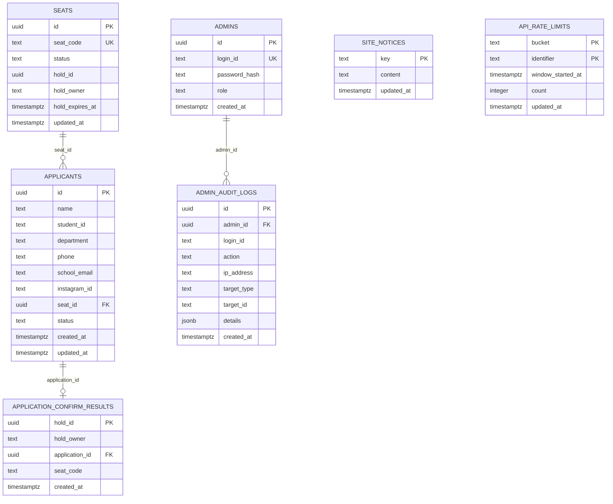

# ERD

현재 Supabase DB 스키마 기준 ERD입니다.

## 테이블 역할

- `seats`: 실제 좌석과 대기 슬롯(`Z1`~`Z16`) 상태를 관리
- `applicants`: 참가 신청자 정보와 좌석/대기 배정 결과를 관리
- `admins`: 관리자 계정 정보 저장
- `admin_audit_logs`: 관리자 로그인, 취소, 좌석 변경 등 감사 로그 저장
- `site_notices`: 홈/완료 페이지 공지 문구 저장
- `api_rate_limits`: 공유형 레이트리밋 상태 저장
- `application_confirm_results`: 신청 확정 API의 멱등성 보장용 결과 저장

## 핵심 관계

- `seats` 1 : N `applicants`
  - 한 좌석은 시간상 여러 신청 이력을 가질 수 있지만, 확정 좌석은 유니크 인덱스로 중복을 막음
- `admins` 1 : N `admin_audit_logs`
  - 한 관리자가 여러 감사 로그를 남길 수 있음
- `applicants` 1 : 0..1 `application_confirm_results`
  - 같은 신청 확정 요청이 재전송돼도 같은 결과를 돌려주기 위한 보조 관계
